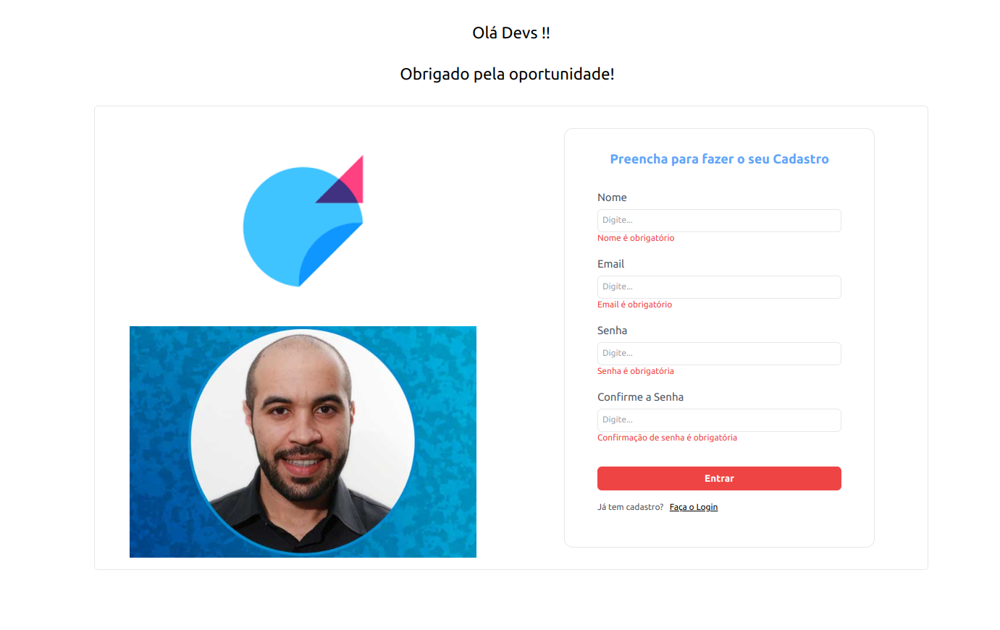
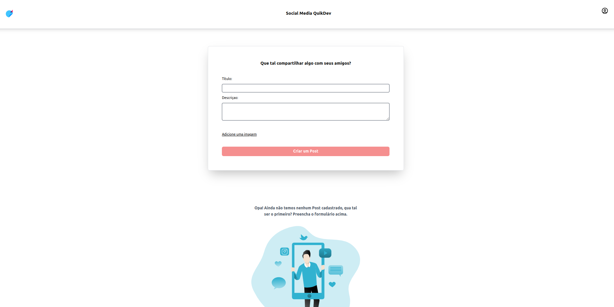
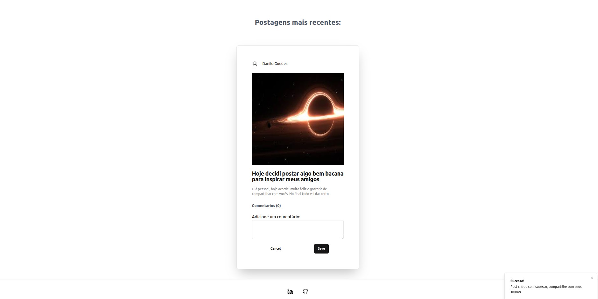
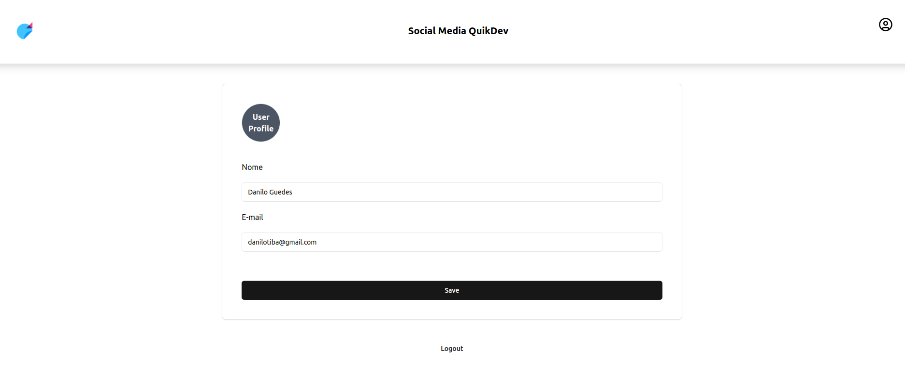
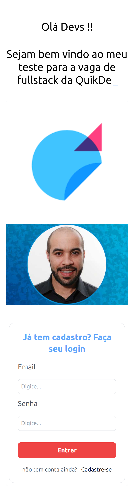
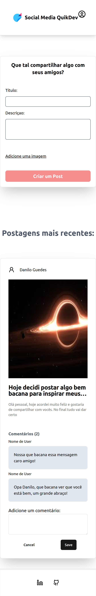

# quikdev-danilo-test

This is a test for fullstack developer in Quikdev made in a weekend, and with more time I will refactor and add more features (probably).

This is a fullstack application built with Vite + React in the front-end and Node.js + Express in the back-end. It' is a simulation for a social media app, with full authentication, user creation, post creation, add comments and so on...

## Front-end

The front-end of this application is developed using:

- Vite: a fast build tool for modern web development.
- React: a popular JavaScript library for building user interfaces.
- Formik: a library for building forms with React.
- Yup: a schema validation library.
- Tailwind CSS: a utility-first CSS framework.
- React Query: a library for fetching and managing data in React applications.

## Back-end

The back-end of this application is developed using:

- Node.js: a JavaScript runtime for server-side development.
- Express: a fast and minimalist web application framework for Node.js.
- Multer: a middleware for handling file uploads in Node.js.
- Passport: an authentication middleware for Node.js.
- SQLite3: a lightweight and embedded database for Node.js.

## Getting Started

> :warning: **WARNING **: This monorepo requires Docker and Docker Compose  installed before proceeding.

To get started with this project, follow the steps below:

1. Clone the repository.

```bash
git clone https://github.com/Danilo-Guedes/quikdev-danilo-test.git
```

2. cd into the project folder

```bash
cd quikdev-danilo-test
```

3. run the docker compose to initiate the application.

```bash
docker-compose up --build
```

4. Open the browser at http://localhost:5173/ (default port for vite apps) and use the application.


## What I would do if I had more time ?

1. Adopt a DDD or Clean Architecture approach to prepare the code for healthy growth.
2. As you create the domain entities, make better use of OOP.
3. Change the fake_bucket to a real implementation of cloud file storage.
4. Create a class to standardize backend errors.
5. If it were a real project, I would be using TypeScript instead of vanilla JavaScript.

## Screenshots








## License

This project is licensed under the [MIT License](LICENSE).
